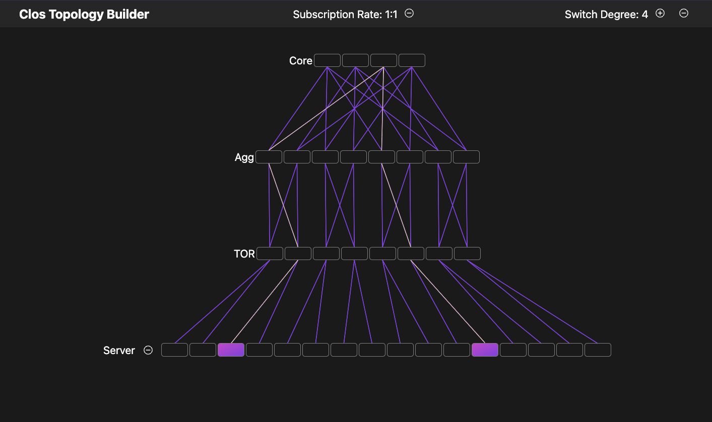

# CLOS TOPOLOGY BUILDER
A project done for the open ended last lab of CSE 453 (Datacenter Systems). A Clos topology is a datacenter network
configuration that provides increased resiliency over a standard tree network and many paths between nodes
which can be used for load balancing via Equal Cost MultiPath routing. This interactive builder is intended to help
visualize different clos network configurations and show paths between every pair of servers. Parameters that can
be modified to edit the topology are: switch degree, subscription rate, and number of servers. Project could be expanded
to simulate netwerk traffic and congestion and to allow flexibility in the number of levels within the topology.
### Services
- Next.js Frontend
    - Interactive UI that allows parametrization of clos topo
    - notable files: `src/pages/index.tsx` `src/components/Switch.tsx`
- Java Backend
    - Given parameters serverDegree & numServers creates a clos topology (implemented via a graph) and returns wiring information and shortest path between each unique pair of servers
    - notable files: `src/main/java/org.cse453/Main` `src/main/java/org.cse453/ClosTopology
### Building & Running
The application is setup to be run via docker compose. Run the application locally with version 20.20.10 of Docker. Make sure Docker is installed and your version is compatible.
- Make sure Docker Desktop is running
- To run the application simply run the command `docker compose up --build` from the directory that this README is in
- Visit `localhost:3000` on a browser

